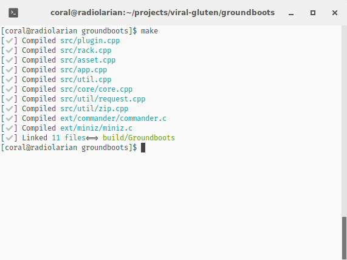

Make it Rain
============

The aim is to have a thin, extensible and pretty `Makefile` for simple C/C++ projects.

If you find Makefile too complex or cumbersome, try `makeitrain`, since many
hard-edges were softened and it's still GNU Makefiles.



## Features

*  Pretty and sane interface.
*  Compatible with many compilers ( gcc, clang, vscode )
*  Cross-platform ( LINUX, WINDOWS, MAC)
*  Compatible with standard `CFLAGS` & `LDFLAGS`
*  Built-in support for `doctests`

## Installation

1. Copy the folder `makerain` to your project.
2. Create a `Makefile` in the project root.
3. Configure it to your taste:

```Makefile
SHELL:=/bin/bash

VERSION :=  "0.0.1"
NAME    :=  hello
TARGET  :=  Release

# Output
OUTPUT_EXE 	  := build/${NAME}

# Dependencies, assets and binary all bundled together for simple
# deployment (eg: Mac .app , flatpack, zip folder...)
OUTPUT_BUNDLE := dist/${NAME}

# Copy Assets to bundle
ASSET_FOLDER 	:= $(NAME).res

# External dependencies, like curl or openssl
# May have both shared lib (.so) and header files
DLL_FOLDER := dep

# Include folders
INCLUDES 	= include/ ext/  						# bultin and 3º party
LIBS 		= m dl pthread curl jansson 			# libm, dlopen, libpthread, libcurl

# Our code & 3party
SOURCES 		= $(wildcard src/*.cpp src/*/*.cpp ext/*/*.c) 

# Entry point
MAIN_APP	= src/main.cpp
TEST_APP 	= src/testsRunner.cpp

# Include build rules
include ./makerain/Makefile
``` 

## Usage

| Description      | command      	            | 
|--------------	   | --------------	            |
| make             | Compile all files         	|
| make dll         | Compile external dependencies | 
| make info        | Display build information 	|
| make run         | Run generated executable   |
| make debug       | Run with debugger attached |
| make doctest     | Compile `doctest`          | 
| make test        | Runs `doctest` 	        | 


## HOW TO: Overwrite config options ?

Use the traditional behaviour of overwriting variables in the SHELL. For example:

#### Use clang as compiler
> CXX=clang CX=clang make

#### Compiling with DEBUG symbols
> TARGET=DEBUG make

## Examples

A barebones App with dynamic library support is included in the directory `examples`.

## DI(WH)Y

```
When the sins of my father
Weigh down in my soul
And the pain of my mother
Will not let me go
Well, I know there can come fire from the sky
To refine the purest of kings
```

## Many thanks to:

* [Andrew belt](https://andrewbelt.name/) for his simple design on [VCVRack](https://github.com/VCVRack/Rack), his code was a inspiration for this tool.
* [Milton Nascimento](https://www.youtube.com/watch?v=ji0BILoWwN8) for saving my life with his music.

## LICENSE 

Simple and permissive MIT license.  

### But if you're rich or a company...

```
Yes, you, iphone user, owner of a house, citizen of a "1º world" country. 80k or more per year.

If you found this useful, please donate some money, µbitcoins or just some github stars.

```

## Assembled in Brazil 🏖